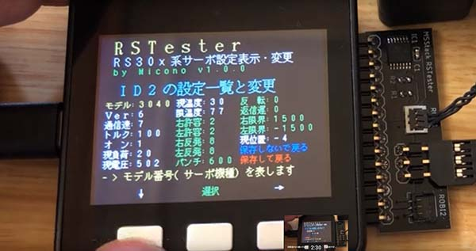
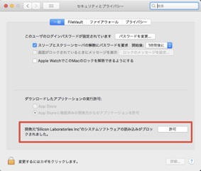
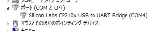

# RSTester (v1.0.3)
RSTesterは、双葉電子工業さんのRS304系のサーボの動作テスト、ID変更および、各種設定の表示や変更を行う為の、M5Stackのプログラムおよび、RS304系のサーボを接続するためのアダプターです。

[LovyanLauncher](https://github.com/lovyan03/M5Stack_LovyanLauncher)に対応していて、microSDからの起動には[LovyanLauncher](https://github.com/lovyan03/M5Stack_LovyanLauncher)もインストールされている必要があります。

**注意：Odroid-GOメニューを使う場合（初期状態の場合）は[LovyanLauncher](https://github.com/lovyan03/M5Stack_LovyanLauncher)のインストールは必要はありません。microSDには[Skeleton file](https://wiki.odroid.com/odroid_go/make_sd_card)を使います。**

どのようなプログラムなのかは、以下の像をクリックすると操作中の動画をで観ることができます。 

## 更新
- １年近く前（2019/11/04）に修正していたんですが公開していなかった不具合で、v1.0.2で、IDを変更できない不具合を含んでしまったため、その修正版です。(v1.0.3)
- スリープ対応 (v1.0.2)
- M5StackのFacesに対応しました (v1.0.1)
- Odroid-GOに対応しました (v1.0.1)

#### Odroid-GO 用のプログラムをビルドをしたい場合

- tobozoさんの、[M5Stackのキメラライブラリー](https://github.com/tobozo/ESP32-Chimera-Core)をダウンロードして、Arduinoフォルダのlibraryフォルダの中のM5Stackの中と入れ替えることで、Odroid-GOのプログラムをボタンの違い以外ほぼ気にすることなるビルドできます。

## インストール

### ① M5Stack / Odroid-GO のmicroSDに入れるもの
Odroid-GOメニューを使う場合（初期状態の場合）は[Skeleton file](https://wiki.odroid.com/odroid_go/make_sd_card)を作成しておきます。

1. 同梱のファイルの中のmicroSDフォルダの中のファイルを、microSDにコピーします。RSTester.binやRSTester.fwというファイルがプログラムになります。**コピー先のmicroSDの中に既にあるフォルダの中のファイルを消してしまわないように結合コピーを選ぶようにして下さい。**
2. 次に、RSTesterが使っている**フォント**（**FONT.BIN**, **FONTLCD.BIN**)が必要になります。これらのファイツをまだ入れてない場合は、ブラウザで、[Tamakichi/Arduino-KanjiFont-Library-SD](https://git.io/fjYst)を開いて下さい。
3. 「**Clone or download**」でD**ownload ZIP**を選び、ダウンロードし、zipを解凍します。
4. そのファイルの中に、fontbinフォルダがあり、中に、**FONT.BIN**, **FONTLCD.BIN**というファイルがあるので、これら２つのファイルをmicroSDにコピーします。
5. これでM5Stackに入れるmicroSDの作成は終了です。このmicroSDをM5Stackに入れて下さい。

### ビルド済みファイル
- in M5_Gamebin ... 4M minimal SPIFFS partition scheme.
- in MF_Gamebin ... Fire defaut partition scheme.
- in OG_Gamebin ... bin file for Odroid-GO.
- in odroid/firmwares ... fw file for Odroid-GO Menu Control.

### ② USBドライバーをインストールする
M5Stackをコンピュータと繋いで、プログラムの転送など通信するためには、Silicon LabsのUSBDriverをインストールする必要があります。もしまだインストールしてなければ
[シリアル接続の確立方法](https://docs.m5stack.com/#/ja/related_documents/establish_serial_connection)
のサイトを参考にしてインストールして下さい。**Odroid-GOメニューを使う場合は必ずしもドライバーのインストールをする必要はありません**

> なお、Macの場合、インストールしただけではセキュリティが通ってないので、インストール後、環境設定のセキュリティとプライバシーの一般で、インストールしたドライバーの許可をして下さい。
> 

### ③ M5Burner_Micで、LovyanLauncherをインストールする
**Odroid-GOメニューを使う場合はこの操作を行ってはいけません!!!**

"[M5Burner_Mic](https://github.com/micutil/M5Burner_Mic)"というプログラムで[LovyanLauncher](https://github.com/lovyan03/M5Stack_LovyanLauncher)をM5StackまたはOdroid-GOにインストールする方法を説明します。

1. [M5Burner_Mic](https://github.com/micutil/M5Burner_Mic) のページから「Download [here](http://micutil.com/download/M5Burner_Mic.zip)」の所でM5Burner\_Micをダウンロードし、解凍して下さい。M5Burner\_Micフォルダはお好みの場所に入れて下さい（**フルパスに日本語名を含まない場所に置くのが無難です**）。
2. M5Stackにインストールする場合：[LovyanLauncher firmware](https://github.com/lovyan03/LovyanLauncher-firmware)のページから「Clone or download」のボタンでダウンロードし解凍。LovyanLauncher-firmware-masterフォルダをM5Burner\_Micのフォルダの中にあるfirmwaresフォルダにコピーして下さい。
3. Odroid-GOにインストールする場合：[Odroid-GO版のLovyanLauncher](https://github.com/lovyan03/M5Stack_LovyanLauncher/blob/master/LovyanLauncher/build_odroid_go/LovyanLauncher.bin)のページの「Download」ボタンをクリックするとダウンロードできます。ダウンロードしたLovyanLauncher.binは、M5Burner\_Mic起動後、M5Burner\_Micのウインドウに**ドラッグ＆ドロップ**して下さい。
2. USBケーブルでパソコンとM5StackまたはOdroid-GOを繋げて下さい。
3. M5Burner\_Micをダブルクリックして起動します。
4. USBシリアルポートをM5StackまたはOdroid-GOのポートに設定します。
 - Macの場合はポートに名前がつくので「**SLAB_USBtoUART**」という名前のポートを選んで下さい。
 - Windowsの場合は、**COM3**とか、COM4とかの名前になっています。ひとつしか表示されてなかったら、それがM5Stackのポートでしょう。もしいくつか表示されているようだったら、コントロールパネルから、デバイスマネージャーのポートをみて番号を確認して下さい。例えば以下の図の場合だと**COM4**であるということになります。 
5. 「Priset」のポップアップメニューで「**LovyanLauncher......**」を選択します。
6. 「**Start**」ボタンをクリックすると、プログラムの転送が開始します。
7. プログラムの転送が終わるとM5StackまたはOdroid-GOは、リセットされ、インストールした**LovyanLauncher**が起動します。

#### LovyanLauncherの操作
	1. メニューの**SD-Updater**を選択して"OK"
	2. microSDに入ってるプログラムの一覧が表示されます。
	3. 目的のプログラムを探して選択し、"OK"
	4. 起動する場合は、"Execute"

#### ODROID-GO Device Firmware Menu Controlsの操作

	1. 電源スイッチ OFF
	2. Bボタンを押したまま, 電源スイッチ On
	3. メニューが表示されたらBボタンを離す

	アプリケーションF/Wの起動
	- A ボタン: アプリケーションF/Wを選択
	- B ボタン: キャンセル
	- Start ボタン: アプリケーションF/Wの書き込み

## 接続
M5Stackとサーボをジャンパーワイヤなどでつなぎます。

	M5Stack		RS304系サーボ（写真の場合上から）
	T2 (17)		…	シグナル
	R2 (16)		…	（半２重を使っている場合）
	5V				…	パワー
	GND				…	グランド

Odroid-GOとサーボをジャンパーワイヤなどでつなぎます。

	Odroid-GO		RS304系サーボ
	#1 GND		…	グランド
	#3 RX3		…	（半２重を使っている場合）
	#4 TX3		…	シグナル
	#10 5V		…	パワー

1. 写真のようなコネクターを作る場合は、ROBOMICのブログの[「週刊 ロビ」 RS308MD 基板側端子の入手とコネクター作成例](http://micono.cocolog-nifty.com/blog/2013/04/rs308md-f205.html)
を参考にして下さい。**ただし、この場合はサーボの情報の取得はできません。** 
 - ロビ１の基板側サーボコネクタの型番：BM03B-ACHSS-GAN-ETF(LF)(SN) [購入先例](https://www.marutsu.co.jp/pc/i/31767074/)
 - ロビ２の基板側サーボコネクタの型番：BM03B-ADHKS-GAN-ETB(LF)(SN) [購入先例](https://www.marutsu.co.jp/GoodsDetail.jsp?q=BM03B-ADHKS-GAN-ETB%28LF%29%28SN%29&salesGoodsCode=15432731&shopNo=3)
 - ＳＯＴ２３変換基板 [購入先例](http://akizukidenshi.com/catalog/g/gP-03660/)
 - 分割ロングピンソケット [購入先例](http://akizukidenshi.com/catalog/g/gC-05779/)

	

2. **M5Stack RSTester専用アンダプターについて**
	- サーボ情報を取得するためには半２重回路にしなくてはいけません。M5Stackに簡単に付けて使えるアダプタを設計しました。アダプターは２種類あり、黒いアダプタと赤いアダプタがあります（図）。
	- 黒いアダプターは、M5Stackの右側面のGPIOに挿して使います（図）。
	- 赤いアダプターは、FireなどのGROVE UARTのコネクタをつなげて使います（図）。

それぞれのアダプターが対応している、M5STack, サーボは、以下の通りです。

	アダプター	　M5Stack				　サーボ
		黒	…	BASIC,GRAY				RS303SR,RS304MD, ロボゼロ, ロビ１、ロビ２
		赤	…	BASIC,GRAY,FIRE,M5GO	ロビ１、ロビ２

Odroid-GOとM5Stack用RSTesterアダプタとつなぐ時。

	Odroid-GO		専用アダプタ
	#1 GND		…	グランド（1番下）
	#3 RX3		…	T2 (17)（上から４番目）（半２重を使っている場合）
	#4 TX3		…	R2 (16) シグナル（上から３番目）
	#10	5V		…	パワー（下から２番目）

回路図：

パーツ：

 - ロビ１の基板側サーボコネクタの型番：BM03B-ACHSS-GAN-ETF(LF)(SN) [購入先例](http://d.digikey.com/qKKS070KNe1p3YL0X0d800K)
 - ロビ２の基板側サーボコネクタの型番：BM03B-ADHKS-GAN-ETB(LF)(SN) [購入先例](http://d.digikey.com/qKKS070KNf1p3YL0X0d900K)
 - 3ステートバッファーIC SN74LV4T125PWR / 74??125?などなど [購入先例](http://d.digikey.com/o00ap00gY10KdSL3KKX7KN0)
 - 抵抗 100Ω (1608)
 - 抵抗 1kΩ (1608)
 - コンデンサー 0.1µF (1608) [購入先例](http://akizukidenshi.com/catalog/g/gP-05621/)
 - GROVE用-4Pコネクタ Ｌ型（オス）[購入先例](http://akizukidenshi.com/catalog/g/gC-12634/)
 
**M5Stack RSTester専用アンダプターに関してのご質問、ご希望等は、micono＠マック.コムまで、問い合わせください。**

## RSTesterの簡単な操作方法

1. サーボをつなげる。注意：複数のサーボがつながっている場合、パソコンからのUSBでは電流不足になる場合があるので、モバイルバッテリーをM5Stackにつなげてください。
2. M5Stackの電源を入れる。
3. TobozoLauncher, LovyanLauncherなどで、RSTesterを起動します。
4. A: 動作テスト、B: ID変更、C: 各種設定（の表示と変更）の機能があります。

### A: 動作テスト
接続されているサーボを回転させて、正しく機能するかテストします。
1. サーボのIDを上下矢印ボタンで選択し、OKボタンを押します。なお**255**は、繋がっているすべてのIDのサーボが対象になります。
2. 動作角度を上下矢印ボタンで選択し、OKボタンをおします。
3. サーボが指定した角度て動作をします。

### B: ID変更
接続されているサーボのIDを変更します。
1. IDを変更する対象のサーボを上下矢印ボタンで選択し、OKボタンを押します。なお**255**は、繋がっているすべてのIDのサーボが対象になります。255を選ぶと繋がっているIDは次の「2」操作で設定したID番号に変わってしまいますのでご注意ください。
2. 変更するID番号を上下矢印ボタンで選択し、OKボタンをおします。
3. サーボのIDを変更して、ROMに書き込んで、サーボをリセットします。

### C: 各種設定
選択したサーボの各種設定値を表示し、変更可能な項目の値を変更することができます。 
**以下の像をクリックすると操作中の動画をで観ることができます。** 

- 下および右矢印で、設定項目を選択できます。選択された項目は**黄色**の文字になります。また下の方に、簡単な説明が表示されます。
- 「選択」ボタンを押すと、その設定に関してのデフォルト値など詳細が表示されます。
	- 白色で表示されていた項目は値の変更はできません。
	- 緑色で表示されていた項目の値は変更できます。
		1. 上下矢印ボタンで設定値を変えて「OK」ボタンを押して下さい。
		2. 「変更しないで一覧に戻る」場合はAボタンを、「変更だけして一覧に戻る」場合はBボタンを、「変更してさらにROMに書き込んでトップメニューに戻る」場合はCボタンを押して下さい。

- なお、変更した値は、ROMへの書き込み操作を行わないと変更しないので、書き込みを行わないで一覧に戻った場合、その変更した設定値を反映させたい場合は、一覧の1番右下の「保存して戻る」を選択してから戻って下さい。
- ROMに書き込まない場合は、サーボの電源をいれなおせば元の値に戻ります。

|表示名|意味|初期値|単位|範囲|読書き|
|-----|---|-----|---|---|---|
|モデル|モデル番号	|-	|- |- |不可|
|Ｖｅｒ|ファーム　　|-	|- |- |不可|
|通信速|通信速度　　|7	|bps |1-9|-|
|トルク|トルク％　　|100	|%|0-100|-|
|オ　ン|トルクオン・オフ　|0 |0オフ,1オン| |-|
|現負荷|電流　|0 |mA | |不可|
|現電圧|電圧　|0 |10mV | |不可|
|現温度|温度　|0 |℃　| |不可|
|限温度|最大温度　|77	|℃　| |不可|
|右許容|右マージン　|2 / 1	|0.1度|0-255|可|
|左許容|左マージン　|2 / 1	|0.1度|0-255|可|
|右反発|右スロープ	|8 / 1	|度|0-255|可|
|左反発|左スロープ	|8 / 1	|度|0-255|可|
|パンチ|パンチ　|600 / 8|0.01% / 0.4%|0-10000 / 0-255|可|
|反　転|回転方向　|1 |-|0正転,1反転|可|
|返速度|リターン待ち時間|0	|µs|-|可|
|右限界|右最大回転角度	|1500 |0.1度|0 - 1500|可|
|左限界|左最大回転角度　|-1500 |0.1度|-1500 - 0|可|
|現位置|現在の回転角度	|0|0.1度|-|不可|
|保存しないで戻る|ROMに書込まない	| | | | |
|保存して戻る|ROMに書込む		| | | | |

- 値/値と書かれているところは、ロビ１の値と、ロビ２の値が異なる場合です。
- 各種設定項目の詳細に関しては、[ロビ１、ロボゼロなどは、RS303MR／RS304MD取扱説明書](http://www.futaba.co.jp/img/uploads/files/robot/command_type_servos/RS303MR_RS304MD_118.pdf)、[ロビ２は、RS204MD取扱説明書](http://www.futaba.co.jp/img/uploads/files/robot/download/RS204MD_104.pdf)を読んで下さい。

#### 操作例：ロビ2のサーボのマージン2、スロープ6、パンチ12に変える場合
1. ロビのマイコンにつながっている、例えば、右足のコネクターを外して、RSTesterアダプタにつけます。
2. M5Stack RSTesterを起動し、Cボタンを押します。
3. IDは255を選びます。
4. AまたはCボタンで「右許容」を選んでBボタンで選択します。
5. Cボタンを２回押して、右許容を2にして、Cボタンを押します。
6. Bボタンを押して、変更して一覧に戻ります。
7. 次に「左許容」を選んで、上の5,6と同じ操作をします。
8. 同様に、右反発をを選んで6に、左反発を選んで6に、パンチを選んで12にします。
9. パンチの設定変更が最後なので、6の操作に相当するところで、Bボタンでなく、Cボタンを押すことにより、変更して、保存（ROMに書き込んで）する操作を行って下さい。もしBボタンで、一覧に戻った場合は、一覧の右下の「保存して戻る」を選んでトップ画面に戻って下さい。

## 履歴
	ver 1.0.3: 2019/11/04 IDを変更できない不具合を修正
	ver 1.0.2: 2019/ 5/17 スリープ対応ほか
	ver 1.0.1: 2019/ 5/12 ODROID-GO対応/FACES対応
	ver 1.0.0: 2019/ 4/ 7

## ライセンス
CC 4.0 BY-NC-ND https://github.com/micutil/M5Stack_RSTester

- 同梱されている書類すべてに関して、無断転載、無断掲載、無断改変を禁じます。
- これらを使ったことにより生じるいかなるトラブルに関しても自己責任においておこなって下さい。
- 作ったばかりなので、まだソースコードがぐちゃぐちゃなので、しばらく、改変禁止とさせて頂きます。リクエスト、アドバイスなどあれば、教えてください。

